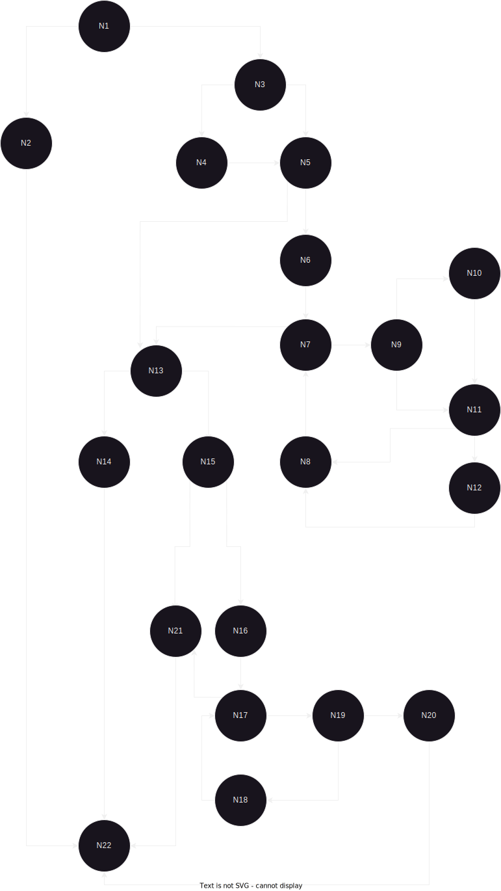

# Втора лабораториска вежба по Софтверско инженерство
## Филип Мазев, бр. на индекс 216006

1. Control Flow Graph

 

 
2. Цикломатска комплексност:
Цикломатската комплексност на овој код е 11, истата ја добив преку формулата:
V(B) = E - N + 2P, каде што Е е бројот на ребра и изнесува 31, N e бројот на јазли и изнесува 22, 
а P е бројот на предикатни јазли и во овој случај изнесува 1, од таму цикломатската комплексност изнесува 11.
 

 
3. Tест случаи според критериумот Every Branch:
   
   3.1 Случај каде корисничкото име, лозинката и е-поштата не се null и задоволени се барањата за лозинка:
      <code> assertTrue(SILab2.function(new User("Filip", "P@ssw0rd2002", "filipmazev@gmail.com"), new ArrayList<User>()));
              Output: true </code>  
    Случај каде корисникот е null / каде корисничкото име е null:
      <code> assertThrows(RuntimeException.class, () -> SILab2.function(null, new ArrayList<User>())); </code>
        Output: RuntimeException "Mandatory information missing!"  </code>  
	
   3.2 Случај каде корисничкото име е null:
   <code> assertThrows(RuntimeException.class, () -> SILab2.function(null, new ArrayList<User>()));
     Output: RuntimeException "Mandatory information missing!"  </code>  
	    
   3.3 Случај каде е-поштата не содржи '@' и '.':
    <code> assertFalse(SILab2.function(new User(null, "password", "filipmazevgmailcom"), new ArrayList<User>()));
      Output: false   </code> 

   3.4 Случај каде корисничкото име веќе постои во листата allUsers:
   <code> 
        var user = new User("Filip", "P@ssw0rd123", "filipmazev@gmail.com");
        var ArrayUsers = new ArrayList<User>(); ArrayUsers.add(user);
        assertFalse(SILab2.function(user, ArrayUsers));
     Output: false   </code>

   3.5 Случај каде лозинката го содржи корисничкото име (case-insensitive):
   <code> assertFalse(SILab2.function(new User("filip", "filip", "filipmazev@gmail.com"), new ArrayList<User>()));
     Output: false   </code>
 

4. Тест случаи според критериумот Multiple Condition:
    4.1 Тест случај каде корисникот е null
   <code> assertThrows(RuntimeException.class, () -> SILab2.function(null, new ArrayList<User>()));
     Output: false   </code>

    4.2 Тест случај каде корисничкото име / е-поштата / лозинката е null; е-поштата не содржи '@' или '.'
   <code> assertThrows(RuntimeException.class, () -> SILab2.function(new User(null, null, null), new ArrayList<User>()));
     Output: false   </code>

    4.3 Тест случај каде лозинката е < 8 карактери; каде лозинката содржи специјални знаци;
   <code>assertFalse(SILab2.function(new User("filip", "p@ssw0r", "filipmazev@gmail.com"), new ArrayList<User>()));
     Output: false   </code>

    4.4 Тест случај каде сите услови се точни
   <code> assertTrue(SILab2.function(new User("filip_mazev", "P@ssw0rd123", "filipmazev@gmail.com"), new ArrayList<User>()));
     Output: false   </code>

 
5. Објаснување на напишаните unit tests
Во тестирањето спроведенот на кодот вклучена беше анализа на цикломатската сложеност 
и тест случаи врз основа на критериумите за секоја гранка и повеќекратни услови. 
Цикломатската сложеност беше пресметана како 11. Случаите за тестирање опфаќаа различни 
сценарија како што се валидација на влезните параметри, задолжителните информации и обезбедување на исполнети барања за лозинка. 
Тестовите резултираа со комбинација на вистинити и лажни исходи, потврдувајќи ја функционалноста на кодот и 
придржувањето до барањата. 
 